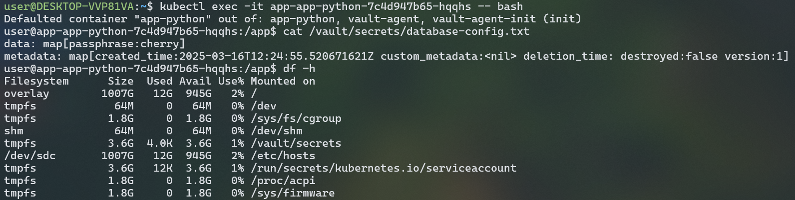
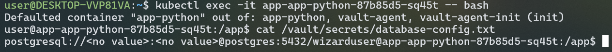
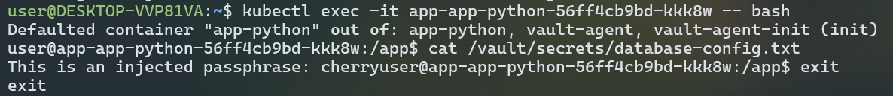

# Kubernetes Secrets

```bash
> kubectl create secret generic testtest --from-literal=passhprase=cherry
secret/testtest created
```

verify:

```bash
> kubectl get secrets
NAME                               TYPE                 DATA   AGE
sh.helm.release.v1.helm-hooks.v1   helm.sh/release.v1   1      55m
testtest                           Opaque               1      48s
```

decode:

```bash
> kubectl get secret testtest -o jsonpath='{.data}'
{"passhprase":"Y2hlcnJ5"}
```

(on WSL, in pwsh i didnt have base64 by default):

```bash
$ echo 'Y2hlcnJ5' | base64 --decode
cherry
```

## Helm

We need to ensure that we have sops and gpg, then:

```bash
$ gpg --gen-key
gpg (GnuPG) 2.4.4; Copyright (C) 2024 g10 Code GmbH
This is free software: you are free to change and redistribute it.
There is NO WARRANTY, to the extent permitted by law.

Note: Use "gpg --full-generate-key" for a full featured key generation dialog.

GnuPG needs to construct a user ID to identify your key.

Real name: muhammad
Email address:
You selected this USER-ID:
    "muhammad"

Change (N)ame, (E)mail, or (O)kay/(Q)uit? O
We need to generate a lot of random bytes. It is a good idea to perform
some other action (type on the keyboard, move the mouse, utilize the
disks) during the prime generation; this gives the random number
generator a better chance to gain enough entropy.
We need to generate a lot of random bytes. It is a good idea to perform
some other action (type on the keyboard, move the mouse, utilize the
disks) during the prime generation; this gives the random number
generator a better chance to gain enough entropy.
gpg: /home/user/.gnupg/trustdb.gpg: trustdb created
gpg: directory '/home/user/.gnupg/openpgp-revocs.d' created
gpg: revocation certificate stored as '/home/user/.gnupg/openpgp-revocs.d/F542FAE49BD3A611BA79842B0341C4F1009A204B.rev'
public and secret key created and signed.

pub   ed25519 2025-03-09 [SC] [expires: 2028-03-08]
      F542FAE49BD3A611BA79842B0341C4F1009A204B
uid                      muhammad
sub   cv25519 2025-03-09 [E] [expires: 2028-03-08]

```

Copy the fingerprint and:

```bash
sops -p F542FAE49BD3A611BA79842B0341C4F1009A204B secrets.yaml
```

In editing mode I just wrote same that was earlier "passhprase: cherry"

Create file `.soms.yaml` with our fingerprint there.
Then proceed to install minikube, kubectl, helm on WSL (there was a trouble that windows helm with sops does not have access for gpg generated keys on wsl, at the very least I couldnt fix) and plugin: `helm plugin install https://github.com/jkroepke/helm-secrets`

Check if everything works:

```bash
$ helm secrets decrypt secrets.yaml
passphrase: cherry
```

Update pods (as it can be seen it's a 7'th revision, so at very first time if it's not installed, there might be needed `--install` flag after upgrade):

```bash
$ helm secrets upgrade app-python app-python/ -f secrets.yaml
[helm-secrets] Decrypt: secrets.yaml
Release "app-python" has been upgraded. Happy Helming!
NAME: app-python
LAST DEPLOYED: Sun Mar  9 23:18:28 2025
NAMESPACE: default
STATUS: deployed
REVISION: 7
NOTES:
1. Get the application URL by running these commands:
     NOTE: It may take a few minutes for the LoadBalancer IP to be available.
           You can watch its status by running 'kubectl get --namespace default svc -w app-python'
  export SERVICE_IP=$(kubectl get svc --namespace default app-python --template "{{ range (index .status.loadBalancer.ingress 0) }}{{.}}{{ end }}")
  echo http://$SERVICE_IP:8080
[helm-secrets] Removed: secrets.yaml.dec
```

Retrieving list of pods:

```bash
$ kubectl get po
NAME                                     READY   STATUS    RESTARTS   AGE
app-python-5c868d476-2c7ks               1/1     Running   0          3m43s
helm-hooks-app-python-7b856f4666-7pl8q   1/1     Running   0          27m
```

Verifying secret inside the pod:

```bash
$ kubectl exec app-python-5c868d476-2c7ks -- printenv | grep passphrase
passphrase=cherry
```

## Vault

Going through provided installation guide and verify that we have vault:

```bash
$ kubectl get pods
NAME                                     READY   STATUS    RESTARTS      AGE
app-python-5c868d476-2c7ks               1/1     Running   1 (97s ago)   4d23h
helm-hooks-app-python-7b856f4666-7pl8q   1/1     Running   1 (97s ago)   5d
vault-0                                  1/1     Running   1 (97s ago)   4d22h
vault-agent-injector-66f45b5fd5-7f48s    1/1     Running   1 (97s ago)   4d22h
```

Setting a secret:

```bash
$ kubectl exec -it vault-0 -- /bin/sh
/ $ vault secrets enable -path=internal kv-v2
Success! Enabled the kv-v2 secrets engine at: internal/
/ $ vault kv put internal/database/config passphrase="cherry"
======== Secret Path ========
internal/data/database/config

======= Metadata =======
Key                Value
---                -----
created_time       2025-03-14T20:21:37.062329587Z
custom_metadata    <nil>
deletion_time      n/a
destroyed          false
version            1
/ $ vault kv get internal/database/config
======== Secret Path ========
internal/data/database/config

======= Metadata =======
Key                Value
---                -----
created_time       2025-03-14T20:21:37.062329587Z
custom_metadata    <nil>
deletion_time      n/a
destroyed          false
version            1

======= Data =======
Key           Value
---           -----
passphrase    cherry
```

Configuring k8s auth:

```bash
$ kubectl exec -it vault-0 -- /bin/sh
/ $ vault auth enable kubernetes
Success! Enabled kubernetes auth method at: kubernetes/
/ $ vault write auth/kubernetes/config \
>       kubernetes_host="https://$KUBERNETES_PORT_443_TCP_ADDR:443"
Success! Data written to: auth/kubernetes/config
/ $ vault policy write internal-app - <<EOF
> path "internal/data/database/config" {
>    capabilities = ["read"]
> }
> EOF
Success! Uploaded policy: internal-app
/ $ vault write auth/kubernetes/role/internal-app \
>       bound_service_account_names=internal-app \
>       bound_service_account_namespaces=default \
>       policies=internal-app \
>       ttl=24h
Success! Data written to: auth/kubernetes/role/internal-app
/ $ exit
```

Defining k8s service account:

```bash
$ kubectl get serviceaccounts
NAME                    SECRETS   AGE
app-python              0         5d
default                 0         5d
helm-hooks-app-python   0         5d
vault                   0         4d22h
vault-agent-injector    0         4d22h
$ kubectl create sa internal-app
serviceaccount/internal-app created
$ kubectl get serviceaccounts
NAME                    SECRETS   AGE
app-python              0         5d
default                 0         5d
helm-hooks-app-python   0         5d
internal-app            0         7s
vault                   0         4d22h
vault-agent-injector    0         4d22h
```

Patching deployment:

```bash
$ kubectl patch deployment app-python --patch "$(cat app-python/patch-inject-secrets.yaml)"
deployment.apps/app-python patched
```

With this approach I faced some issues, with permissions denied error (403).

So I made some cleanup with deleting secret "secrets" which was triggering some error and deleted service accounts, reinstalled vault (and same steps above with adding same secret: passphrase="cherry"), changed values.yaml with specifiying service account name there with other changes and used helm secrets upgrade:

```bash
$ helm secrets upgrade --install app app-python/ -n default -f secrets.yaml
[helm-secrets] Decrypt: secrets.yaml
Release "app" has been upgraded. Happy Helming!
NAME: app
LAST DEPLOYED: Sun Mar 16 15:32:51 2025
NAMESPACE: default
STATUS: deployed
REVISION: 7
NOTES:
1. Get the application URL by running these commands:
     NOTE: It may take a few minutes for the LoadBalancer IP to be available.
           You can watch its status by running 'kubectl get --namespace default svc -w app-app-python'
  export SERVICE_IP=$(kubectl get svc --namespace default app-app-python --template "{{ range (index .status.loadBalancer.ingress 0) }}{{.}}{{ end }}")
  echo http://$SERVICE_IP:8080
[helm-secrets] Removed: secrets.yaml.dec
```

After that it didnt stuck on initializing, so we can exec:



Applying a template to the injected secrets:

```bash
$ kubectl patch deployment app-app-python --patch "$(cat app-python/patch-inject-secrets-as-template.yaml)"
deployment.apps/app-app-python patched
```

```bash
$ kubectl get pods
NAME                                     READY   STATUS     RESTARTS      AGE
app-app-python-87b85d5-sq45t             2/2     Running    0             9s
helm-hooks-app-python-55c989fdc4-mgffz   0/2     Init:0/1   0             19m
helm-hooks-app-python-7b856f4666-7pl8q   1/1     Running    4 (44m ago)   6d16h
vault-0                                  1/1     Running    0             24m
vault-agent-injector-66f45b5fd5-9n8mh    1/1     Running    0             24m
```

While executing into container, I got:



The issue is because I used "passphrase" secret not username and password which are used in template, so I will just redefine in template another custom text with my secret (to show that template applies correctly) instead creating new secrets:

```yaml
# patch-inject-secrets-as-template.yaml
...
vault.hashicorp.com/agent-inject-template-database-config.txt: |
          {{- with secret "internal/data/database/config" -}}
          This is an injected passphrase: {{ .Data.data.passphrase }}
          {{- end -}}
```

Same patching command as earlier and executing into container:



We can see "cherry" now
