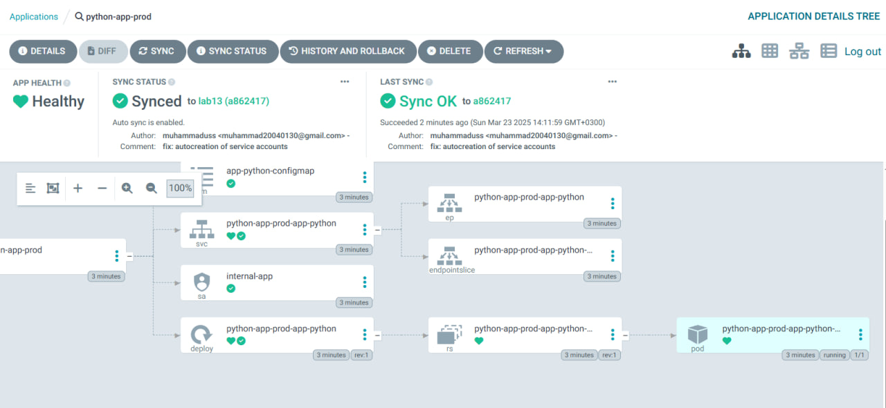
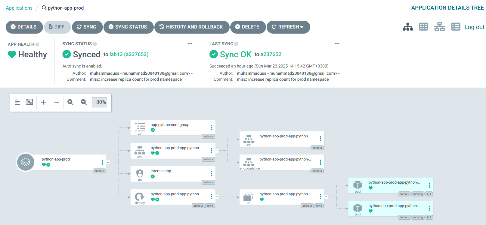
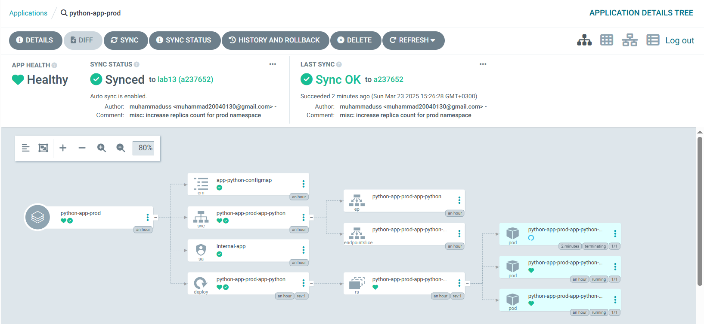
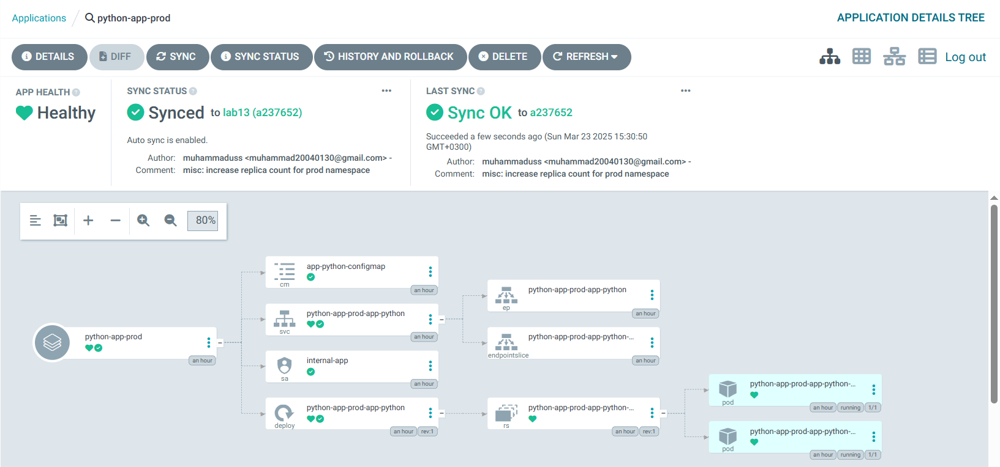
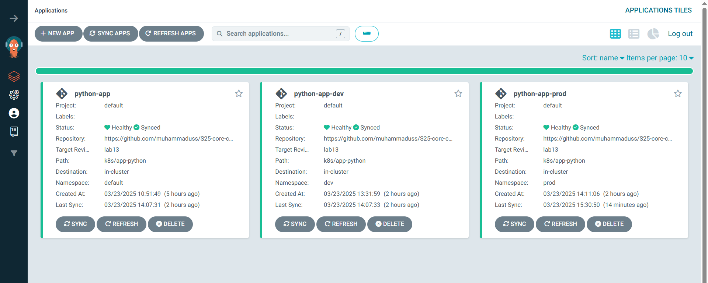

# ArgoCD

Sync check:

```bash
$ argocd app get python-app
Name:               argocd/python-app
Project:            default
Server:             https://kubernetes.default.svc
Namespace:          default
URL:                https://argocd.example.com/applications/python-app
Source:
- Repo:             https://github.com/muhammaduss/S25-core-course-labs.git
  Target:           lab13
  Path:             k8s/app-python
  Helm Values:      values.yaml
SyncWindow:         Sync Allowed
Sync Policy:        Automated (Prune)
Sync Status:        Synced to lab13 (d7e741d)
Health Status:      Healthy

GROUP  KIND        NAMESPACE  NAME                   STATUS     HEALTH   HOOK      MESSAGE
       Pod         default    preinstall-hook        Succeeded           PreSync   pod/preinstall-hook unchanged
       ConfigMap   default    app-python-configmap   Synced                        configmap/app-python-configmap unchanged
       Service     default    python-app-app-python  Synced     Healthy            service/python-app-app-python created
apps   Deployment  default    python-app-app-python  Synced     Healthy            deployment.apps/python-app-app-python configured
       Pod         default    postinstall-hook       Succeeded           PostSync  pod/postinstall-hook created
```

After commit:

```bash
$ argocd app get python-app
Name:               argocd/python-app
Project:            default
Server:             https://kubernetes.default.svc
Namespace:          default
URL:                https://argocd.example.com/applications/python-app
Source:
- Repo:             https://github.com/muhammaduss/S25-core-course-labs.git
  Target:           lab13
  Path:             k8s/app-python
  Helm Values:      values.yaml
SyncWindow:         Sync Allowed
Sync Policy:        Automated (Prune)
Sync Status:        Synced to lab13 (cf68d9d)
Health Status:      Healthy

GROUP  KIND        NAMESPACE  NAME                   STATUS     HEALTH   HOOK      MESSAGE
       Pod         default    preinstall-hook        Succeeded           PreSync   pod/preinstall-hook created
       ConfigMap   default    app-python-configmap   Synced                        configmap/app-python-configmap unchanged
       Service     default    python-app-app-python  Synced     Healthy            service/python-app-app-python unchanged
apps   Deployment  default    python-app-app-python  Synced     Healthy            deployment.apps/python-app-app-python configured
       Pod         default    postinstall-hook       Succeeded           PostSync  pod/postinstall-hook created
```

We can see that commit generated number differs on second one.

## Multi-Environment Deployment

Testing prod namespace, before commit (there were 1 replica):



After commit (increased to 2 replicas):



### Test 1: Manual override of Replica count

After running:

```bash
kubectl patch deployment python-app-prod-app-python -n prod --patch '{"spec":{"replicas": 3}}'
```

We can see that now we have 3 replicas (and because of auto sync third already terminating):



So when we run:

```bash
user@DESKTOP-VVP81VA:~$ argocd app sync python-app-prod
TIMESTAMP                  GROUP        KIND       NAMESPACE                  NAME          STATUS   HEALTH        HOOK  MESSAGE
2025-03-23T15:29:47+03:00          ConfigMap            prod  app-python-configmap          Synced
2025-03-23T15:29:47+03:00            Service            prod  python-app-prod-app-python    Synced  Healthy
2025-03-23T15:29:47+03:00         ServiceAccount        prod          internal-app          Synced
2025-03-23T15:29:47+03:00   apps  Deployment            prod  python-app-prod-app-python    Synced  Healthy
2025-03-23T15:29:49+03:00                Pod        prod       preinstall-hook
2025-03-23T15:29:51+03:00                Pod        prod       preinstall-hook   Running   Synced     PreSync  pod/preinstall-hook created
2025-03-23T15:30:23+03:00          ConfigMap            prod  app-python-configmap          Synced                        configmap/app-python-configmap unchanged
2025-03-23T15:30:23+03:00            Service            prod  python-app-prod-app-python    Synced   Healthy              service/python-app-prod-app-python unchanged
2025-03-23T15:30:23+03:00   apps  Deployment            prod  python-app-prod-app-python    Synced   Healthy              deployment.apps/python-app-prod-app-python unchanged
2025-03-23T15:30:23+03:00                Pod            prod       preinstall-hook        Succeeded   Synced     PreSync  pod/preinstall-hook created
2025-03-23T15:30:23+03:00         ServiceAccount        prod          internal-app          Synced                        serviceaccount/internal-app unchanged
2025-03-23T15:30:23+03:00                Pod        prod      postinstall-hook   Running   Synced    PostSync  pod/postinstall-hook created
2025-03-23T15:30:50+03:00                Pod        prod      postinstall-hook  Succeeded   Synced    PostSync  pod/postinstall-hook created

Name:               argocd/python-app-prod
Project:            default
Server:             https://kubernetes.default.svc
Namespace:          prod
URL:                https://argocd.example.com/applications/python-app-prod
Source:
- Repo:             https://github.com/muhammaduss/S25-core-course-labs.git
  Target:           lab13
  Path:             k8s/app-python
  Helm Values:      values-prod.yaml
SyncWindow:         Sync Allowed
Sync Policy:        Automated (Prune)
Sync Status:        Synced to lab13 (a237652)
Health Status:      Healthy

Operation:          Sync
Sync Revision:      a237652fdda51b47e84b3172d25ae9cae9a0a206
Phase:              Succeeded
Start:              2025-03-23 15:29:47 +0300 MSK
Finished:           2025-03-23 15:30:50 +0300 MSK
Duration:           1m3s
Message:            successfully synced (no more tasks)

GROUP  KIND            NAMESPACE  NAME                        STATUS     HEALTH   HOOK      MESSAGE
       Pod             prod       preinstall-hook             Succeeded           PreSync   pod/preinstall-hook created
       ServiceAccount  prod       internal-app                Synced                        serviceaccount/internal-app unchanged
       ConfigMap       prod       app-python-configmap        Synced                        configmap/app-python-configmap unchanged
       Service         prod       python-app-prod-app-python  Synced     Healthy            service/python-app-prod-app-python unchanged
apps   Deployment      prod       python-app-prod-app-python  Synced     Healthy            deployment.apps/python-app-prod-app-python unchanged
       Pod             prod       postinstall-hook            Succeeded           PostSync  pod/postinstall-hook created
```

```bash
user@DESKTOP-VVP81VA:~$ argocd app get python-app-prod
Name:               argocd/python-app-prod
Project:            default
Server:             https://kubernetes.default.svc
Namespace:          prod
URL:                https://argocd.example.com/applications/python-app-prod
Source:
- Repo:             https://github.com/muhammaduss/S25-core-course-labs.git
  Target:           lab13
  Path:             k8s/app-python
  Helm Values:      values-prod.yaml
SyncWindow:         Sync Allowed
Sync Policy:        Automated (Prune)
Sync Status:        Synced to lab13 (a237652)
Health Status:      Healthy

GROUP  KIND            NAMESPACE  NAME                        STATUS     HEALTH   HOOK      MESSAGE
       Pod             prod       preinstall-hook             Succeeded           PreSync   pod/preinstall-hook created
       ServiceAccount  prod       internal-app                Synced                        serviceaccount/internal-app unchanged
       ConfigMap       prod       app-python-configmap        Synced                        configmap/app-python-configmap unchanged
       Service         prod       python-app-prod-app-python  Synced     Healthy            service/python-app-prod-app-python unchanged
apps   Deployment      prod       python-app-prod-app-python  Synced     Healthy            deployment.apps/python-app-prod-app-python unchanged
       Pod             prod       postinstall-hook            Succeeded           PostSync  pod/postinstall-hook created
```



So it returned to 2 initial replicas.

### Test 2: Deletion of Pod

Before deletion:

```bash
$ kubectl get pods -n prod
NAME                                          READY   STATUS    RESTARTS   AGE
python-app-prod-app-python-86d457f7dd-mhrtf   1/1     Running   0          83m
python-app-prod-app-python-86d457f7dd-npv7s   1/1     Running   0          87m
```

Delete:

```bash
user@DESKTOP-VVP81VA:~$ kubectl delete pod -n prod -l app.kubernetes.io/name=app-python
pod "python-app-prod-app-python-86d457f7dd-mhrtf" deleted
pod "python-app-prod-app-python-86d457f7dd-npv7s" deleted
```

Check for recreation:

```bash
user@DESKTOP-VVP81VA:~$ kubectl get pods -n prod -w
NAME                                          READY   STATUS    RESTARTS   AGE
python-app-prod-app-python-86d457f7dd-7hh9v   1/1     Running   0          25s
python-app-prod-app-python-86d457f7dd-scp6d   1/1     Running   0          25s
```

```bash
argocd app diff python-app-prod
```

There were no output, so no drift.

Dashboard (if I get correctly, there is sync status as well on "Status" line):



Answer to a question: I think it compares states and if there is a mismatch - it returns to the desired state which is on VCS.
