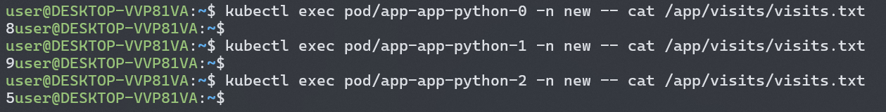
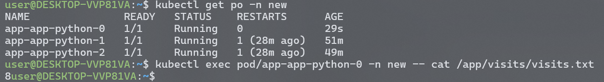
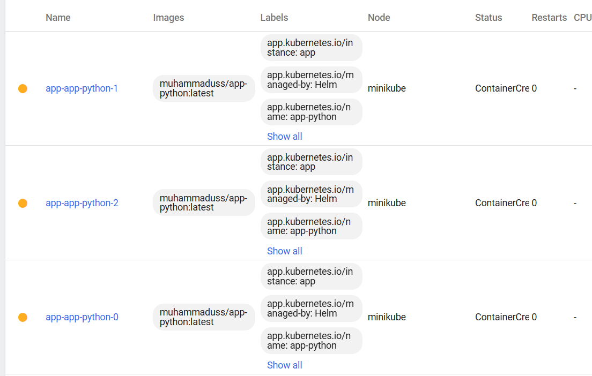

# StatefulSet

```bash
$ kubectl get po,sts,svc,pvc -n new
NAME                   READY   STATUS    RESTARTS      AGE
pod/app-app-python-0   1/1     Running   1 (17m ago)   43m
pod/app-app-python-1   1/1     Running   1 (17m ago)   39m
pod/app-app-python-2   1/1     Running   1 (17m ago)   37m

NAME                              READY   AGE
statefulset.apps/app-app-python   3/3     43m

NAME                     TYPE           CLUSTER-IP       EXTERNAL-IP   PORT(S)          AGE
service/app-app-python   LoadBalancer   10.101.249.129   <pending>     8080:32426/TCP   43m

NAME                                            STATUS   VOLUME                                     CAPACITY   ACCESS MODES   STORAGECLASS   VOLUMEATTRIBUTESCLASS   AGE
persistentvolumeclaim/visits-app-app-python-0   Bound    pvc-c47486a3-e8e7-45d9-b3ce-a7a53628158f   1Gi        RWO            standard       <unset>                 109m
persistentvolumeclaim/visits-app-app-python-1   Bound    pvc-bd9c7827-9baf-4d68-b62a-4d2721d8f28b   1Gi        RWO            standard       <unset>                 109m
persistentvolumeclaim/visits-app-app-python-2   Bound    pvc-4a9f3647-3796-45a1-9d01-8cec5d90817f   1Gi        RWO            standard       <unset>                 109m
```

Here I created new namespace, so this command is with a flag.

Let's check for each pod value of /visits count after some tests and refreshes:



As we can observe, each pod has its own value of visits, and it also proven when we refresh some time `/visits` endpoint itself: there are different numbers shown as well.

I think it's because data storage was mounted for each pod, and there is no shared big storage to sync with, and probably handle of it will require more complex approach, because we need to ensure consistency between each transaction of read/write from each pod.


Delete a pod and check PVC:

```bash
$ kubectl delete pod app-app-python-0 -n new
pod "app-app-python-0" deleted
$ kubectl get pvc
NAME                       STATUS   VOLUME                                     CAPACITY   ACCESS MODES   STORAGECLASS   VOLUMEATTRIBUTESCLASS   AGE
storage-app-app-python-0   Bound    pvc-45522883-6a82-4461-8e8b-6b2af292cb83   1Gi        RWO            standard       <unset>
8h
storage-app-app-python-1   Bound    pvc-f6144c0b-27b1-4ed3-b40a-9f81d1b16abe   1Gi        RWO            standard       <unset>
8h
storage-app-app-python-2   Bound    pvc-0632d909-8b6a-4c5e-834c-ea4dacffc16b   1Gi        RWO            standard       <unset>
8h
```

Verify that data persists, when pod recreated:



Accessing via DNS:

```bash
$ kubectl exec app-app-python-0 -- nslookup app-app-python-1.app-app-python.default.svc.cluster.local
Server:         10.96.0.10
Address:        10.96.0.10#53

Name:   app-app-python-1.app-app-python.default.svc.cluster.local
Address: 10.244.0.155
```

Monitoring & Alerts:

Liveness - determining when to restart a container. Readiness - is container ready to accept traffic.
In default provided by helm: probes using GET http request to root for their checks.

Ordering Guarantee and Parallel Operations:

I thinkg ordering guarantee is unnecessary because in my application any pod can handle request for MSK time.

After adding parallel pod management policy to statefulset.yaml, we can observe that each pod creating in parallel (previously were one by one):

