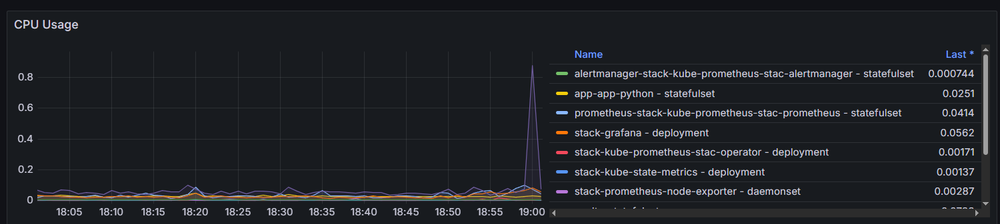
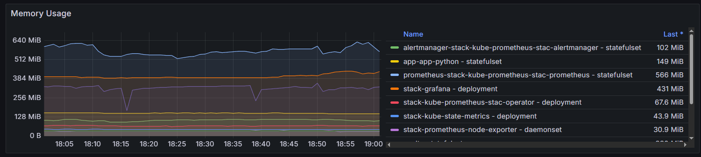
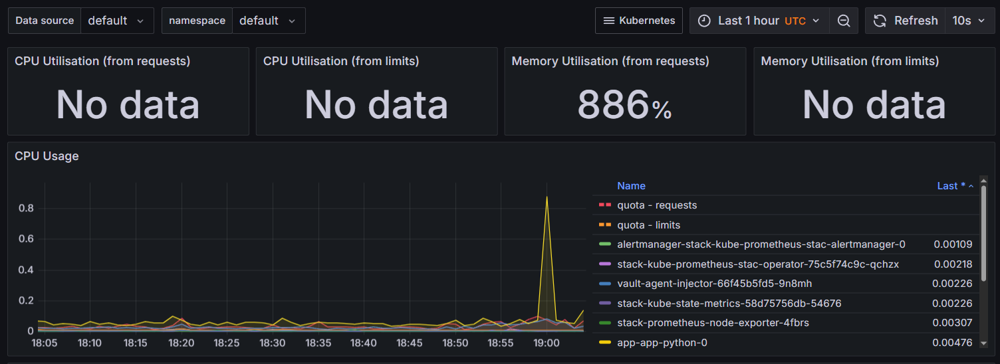
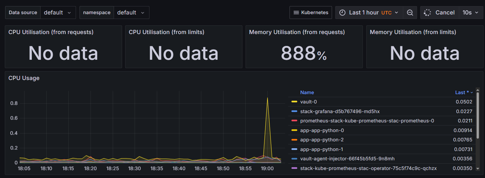
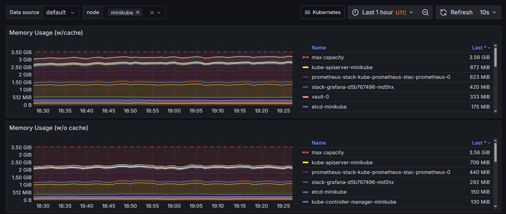
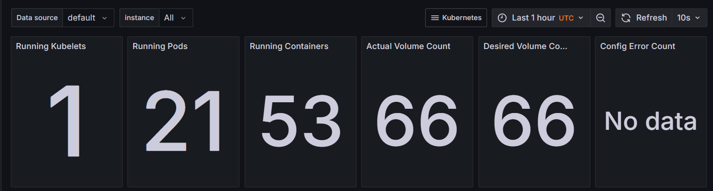
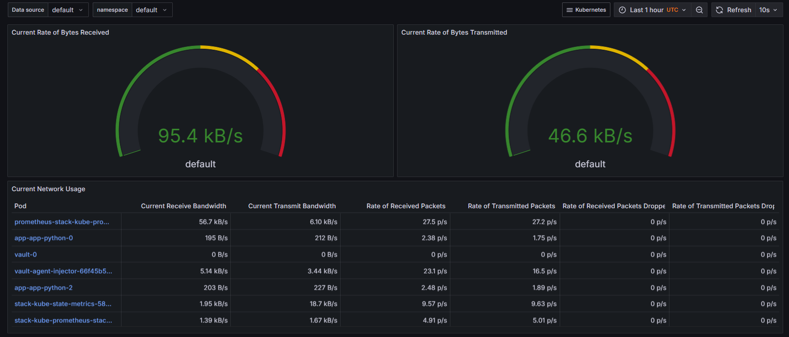
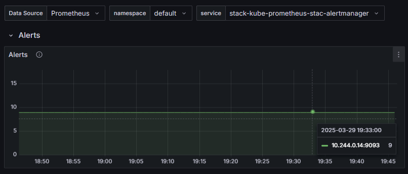
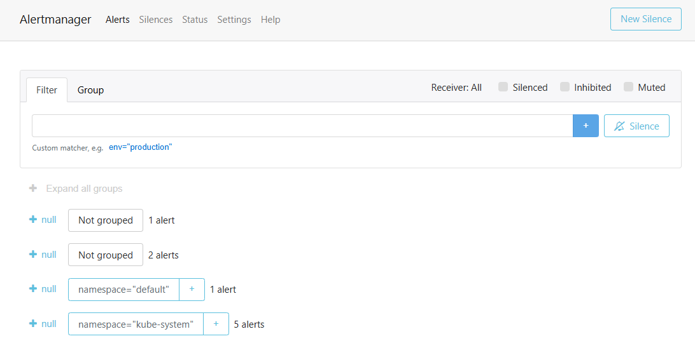
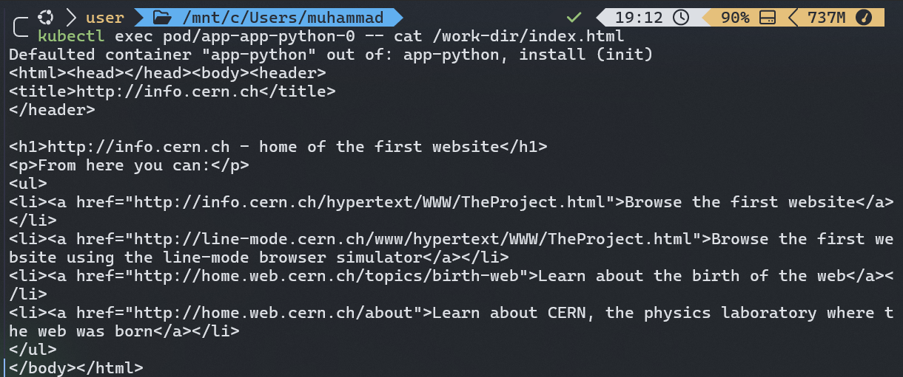

# Kubernetes Monitoring and Init Containers

```bash
─ helm install stack prometheus-community/kube-prometheus-stack
NAME: stack
LAST DEPLOYED: Fri Mar 28 19:24:37 2025
NAMESPACE: default
STATUS: deployed
REVISION: 1
NOTES:
kube-prometheus-stack has been installed. Check its status by running:
  kubectl --namespace default get pods -l "release=stack"

Get Grafana 'admin' user password by running:

  kubectl --namespace default get secrets stack-grafana -o jsonpath="{.data.admin-password}" | base64 -d ; echo

Access Grafana local instance:

  export POD_NAME=$(kubectl --namespace default get pod -l "app.kubernetes.io/name=grafana,app.kubernetes.io/instance=stack" -oname)
  kubectl --namespace default port-forward $POD_NAME 3000

Visit https://github.com/prometheus-operator/kube-prometheus for instructions on how to create & configure Alertmanager and Prometheus instances using the Operator.
```

Components:

*The Prometheus Operator* - this component provides Kubernetes convinient management of Prometheus and other linked monitoring components.

*Prometheus* - open source service for monitoring, with dimensional data model and time series database.

*Alertmanager* - handles alerts on some events and sends to the team when necessary, we can configure sending to email in case of need by some mechanisms.

*Prometheus Node Exporter* - component for gathering hardware metrics and sending them to Prometheus

*Prometheus Blackbox Exporter* - component for gathering metrics over endpoints like HTTP, HTTPS and so on.

*Prometheus Adapter* - gathers available metrics from Prometheus at some interval and exposes metrics with custom specification.

*Kubernetes State Metrics* - listening service which generate metrics for states of objects inside Kubernetes cluster

```bash
> kubectl get po,sts,svc,pvc,cm
NAME                                                         READY   STATUS    RESTARTS      AGE
pod/alertmanager-stack-kube-prometheus-stac-alertmanager-0   2/2     Running   2 (22h ago)   26h
pod/app-app-python-0                                         1/1     Running   1 (22h ago)   28h
pod/app-app-python-1                                         1/1     Running   1 (22h ago)   28h
pod/app-app-python-2                                         1/1     Running   1 (22h ago)   28h
pod/prometheus-stack-kube-prometheus-stac-prometheus-0       2/2     Running   2 (22h ago)   26h
pod/stack-grafana-d5b767496-md5hx                            3/3     Running   3 (22h ago)   26h
pod/stack-kube-prometheus-stac-operator-75c5f74c9c-qchzx     1/1     Running   2 (10h ago)   26h
pod/stack-kube-state-metrics-58d75756db-54676                1/1     Running   2 (10h ago)   26h
pod/stack-prometheus-node-exporter-4fbrs                     1/1     Running   1 (22h ago)   26h
pod/vault-0                                                  1/1     Running   2 (22h ago)   13d
pod/vault-agent-injector-66f45b5fd5-9n8mh                    1/1     Running   2 (22h ago)   13d

NAME                                                                    READY   AGE
statefulset.apps/alertmanager-stack-kube-prometheus-stac-alertmanager   1/1     26h
statefulset.apps/app-app-python                                         3/3     28h
statefulset.apps/prometheus-stack-kube-prometheus-stac-prometheus       1/1     26h
statefulset.apps/vault                                                  1/1     13d

NAME                                              TYPE        CLUSTER-IP       EXTERNAL-IP   PORT(S)                      AGE
service/alertmanager-operated                     ClusterIP   None             <none>        9093/TCP,9094/TCP,9094/UDP   26h
service/app-app-python                            ClusterIP   10.110.100.77    <none>        8080/TCP                     28h
service/kubernetes                                ClusterIP   10.96.0.1        <none>        443/TCP                      19d
service/prometheus-operated                       ClusterIP   None             <none>        9090/TCP                     26h
service/stack-grafana                             ClusterIP   10.111.97.50     <none>        80/TCP                       26h
service/stack-kube-prometheus-stac-alertmanager   ClusterIP   10.109.200.55    <none>        9093/TCP,8080/TCP            26h
service/stack-kube-prometheus-stac-operator       ClusterIP   10.108.62.10     <none>        443/TCP                      26h
service/stack-kube-prometheus-stac-prometheus     ClusterIP   10.109.22.75     <none>        9090/TCP,8080/TCP            26h
service/stack-kube-state-metrics                  ClusterIP   10.100.154.95    <none>        8080/TCP                     26h
service/stack-prometheus-node-exporter            ClusterIP   10.101.252.225   <none>        9100/TCP                     26h
service/vault                                     ClusterIP   10.103.113.224   <none>        8200/TCP,8201/TCP            13d
service/vault-agent-injector-svc                  ClusterIP   10.108.159.32    <none>        443/TCP                      13d
service/vault-internal                            ClusterIP   None             <none>        8200/TCP,8201/TCP            13d

NAME                                                 STATUS   VOLUME                                     CAPACITY   ACCESS MODES   STORAGECLASS   VOLUMEATTRIBUTESCLASS   AGE
persistentvolumeclaim/data-vault-server-0            Bound    pvc-2c15da15-2822-4d19-a632-7cd94f89c327   10Gi       RWO            standard       <unset>                 19d
persistentvolumeclaim/visits-app-app-python-0        Bound    pvc-8ca595f8-03d0-43cc-8df8-dd026de391e1   1Gi        RWO            standard       <unset>                 30h
persistentvolumeclaim/visits-app-app-python-1        Bound    pvc-c98e92ec-f329-4ef3-933c-757e4711031f   1Gi        RWO            standard       <unset>                 30h
persistentvolumeclaim/visits-app-app-python-2        Bound    pvc-610b26e5-eb80-4db9-8089-116bd55566a4   1Gi        RWO            standard       <unset>                 30h
persistentvolumeclaim/visits-app-prod-app-python-0   Bound    pvc-e4f21f9b-1ae9-45d1-8e9e-c5e09d373061   1Gi        RWO            standard       <unset>                 29h
persistentvolumeclaim/visits-app-prod-app-python-1   Bound    pvc-465deef0-3d23-41a8-a993-02a723b11c16   1Gi        RWO            standard       <unset>                 29h

NAME                                                                     DATA   AGE
configmap/app-python-configmap                                           1      28h
configmap/kube-root-ca.crt                                               1      19d
configmap/prometheus-stack-kube-prometheus-stac-prometheus-rulefiles-0   35     26h
configmap/stack-grafana                                                  1      26h
configmap/stack-grafana-config-dashboards                                1      26h
configmap/stack-kube-prometheus-stac-alertmanager-overview               1      26h
configmap/stack-kube-prometheus-stac-apiserver                           1      26h
configmap/stack-kube-prometheus-stac-cluster-total                       1      26h
configmap/stack-kube-prometheus-stac-controller-manager                  1      26h
configmap/stack-kube-prometheus-stac-etcd                                1      26h
configmap/stack-kube-prometheus-stac-grafana-datasource                  1      26h
configmap/stack-kube-prometheus-stac-grafana-overview                    1      26h
configmap/stack-kube-prometheus-stac-k8s-coredns                         1      26h
configmap/stack-kube-prometheus-stac-k8s-resources-cluster               1      26h
configmap/stack-kube-prometheus-stac-k8s-resources-multicluster          1      26h
configmap/stack-kube-prometheus-stac-k8s-resources-namespace             1      26h
configmap/stack-kube-prometheus-stac-k8s-resources-node                  1      26h
configmap/stack-kube-prometheus-stac-k8s-resources-pod                   1      26h
configmap/stack-kube-prometheus-stac-k8s-resources-workload              1      26h
configmap/stack-kube-prometheus-stac-k8s-resources-workloads-namespace   1      26h
configmap/stack-kube-prometheus-stac-kubelet                             1      26h
configmap/stack-kube-prometheus-stac-namespace-by-pod                    1      26h
configmap/stack-kube-prometheus-stac-namespace-by-workload               1      26h
configmap/stack-kube-prometheus-stac-node-cluster-rsrc-use               1      26h
configmap/stack-kube-prometheus-stac-node-rsrc-use                       1      26h
configmap/stack-kube-prometheus-stac-nodes                               1      26h
configmap/stack-kube-prometheus-stac-nodes-aix                           1      26h
configmap/stack-kube-prometheus-stac-nodes-darwin                        1      26h
configmap/stack-kube-prometheus-stac-persistentvolumesusage              1      26h
configmap/stack-kube-prometheus-stac-pod-total                           1      26h
configmap/stack-kube-prometheus-stac-prometheus                          1      26h
configmap/stack-kube-prometheus-stac-proxy                               1      26h
configmap/stack-kube-prometheus-stac-scheduler                           1      26h
configmap/stack-kube-prometheus-stac-workload-total                      1      26h
```

First part we have pods, there is pods of vault, my application and logging stack. Then we have stateful sets: for my application, vault and alertmanager with prometheus. Under we have a lot of services for logging stack and one for my application. Then we have persistent volume claims (from pervious assignment) and configmaps, most of them are for logging stack.


## Grafana Dashboards

**CPU and Memory consumption of StatefulSet:**





**Pods with higher and lower CPU usage in the default namespace:**





> So, we can sort by ascending or descending: vault-0 highest and altertmanager is lowest

**Monitor node memory usage in percentage and megabytes**:



> Only megabytes, didn't found any percentages unfortunately

**Count the number of pods and containers managed by the Kubelet service**:



pods - 21, containers - 53

**Evaluate network usage of Pods in the default namespace**:



**Number of alerts**:



We can derive from here 9 active alerts, as proof we can check Alertmanager Web UI and see overall 9 as well



## Init Containers

