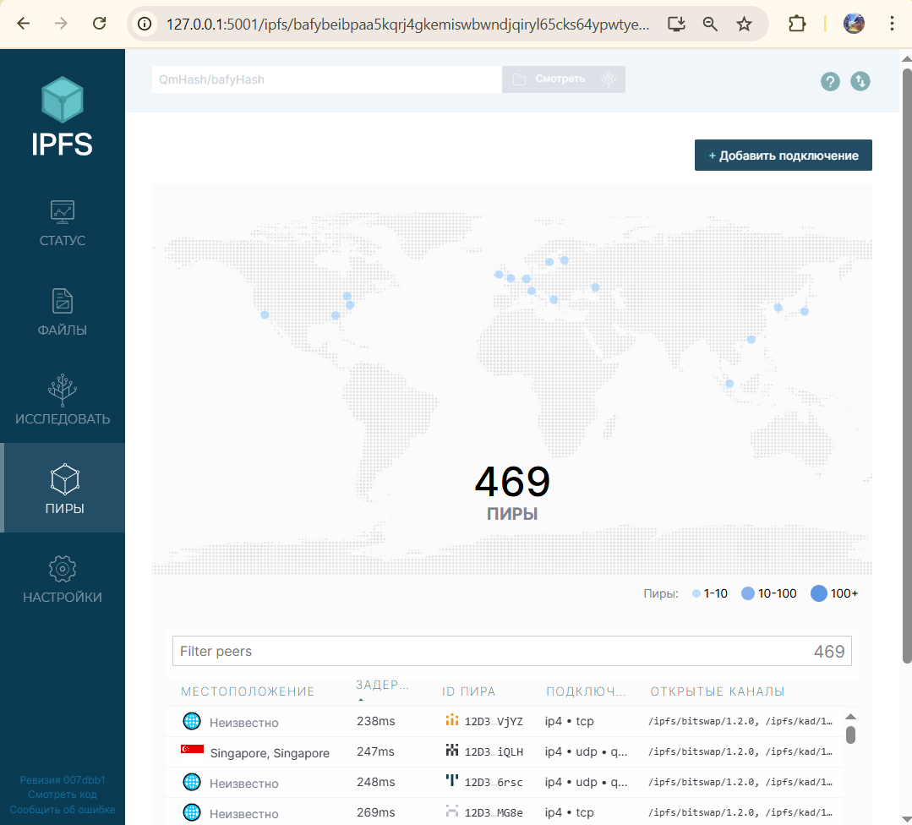
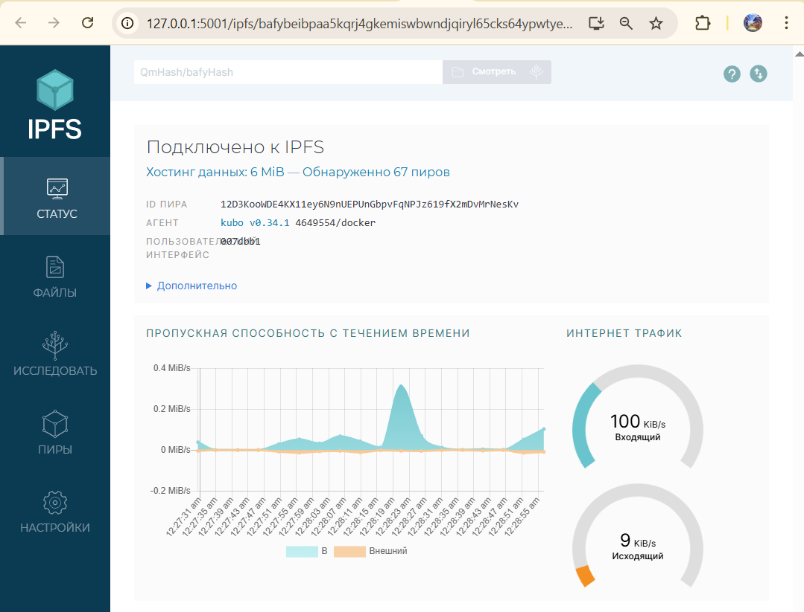
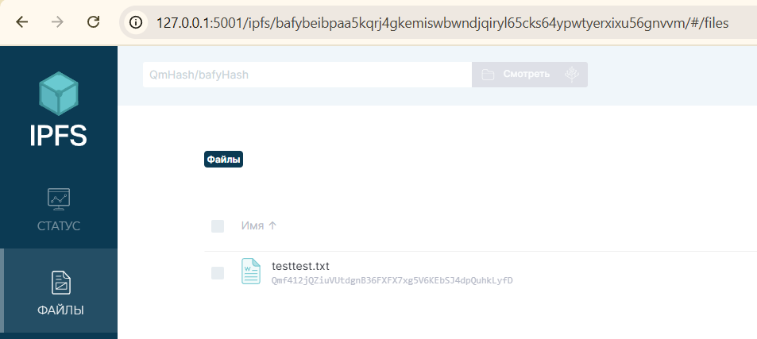
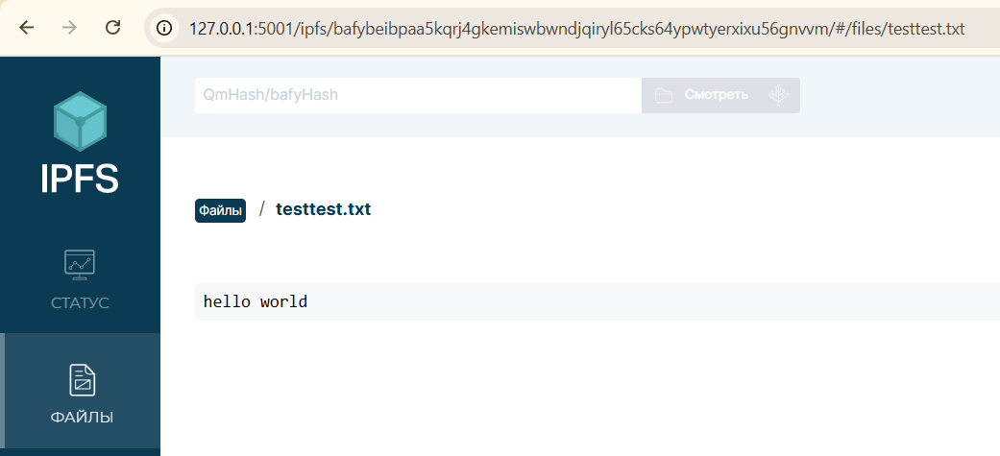
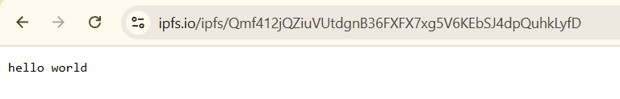
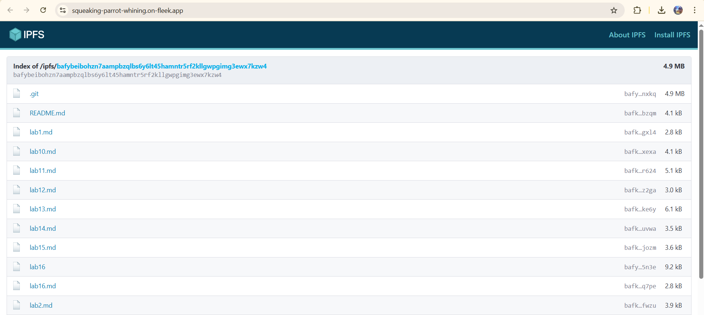

# IPFS and Fleek

## IPFS Gateway

Peers:

Bandwidth:

File CID: `Qmf412jQZiuVUtdgnB36FXFX7xg5V6KEbSJ4dpQuhkLyfD`

[URL](https://ipfs.io/ipfs/Qmf412jQZiuVUtdgnB36FXFX7xg5V6KEbSJ4dpQuhkLyfD)

## Fleek.xyz

[URL](https://squeaking-parrot-whining.on-fleek.app/) | [IPFS](https://ipfs.io/ipfs/bafybeibohzn7aampbzqlbs6y6lt45hamntr5rf2kllgwpgimg3ewx7kzw4/)

