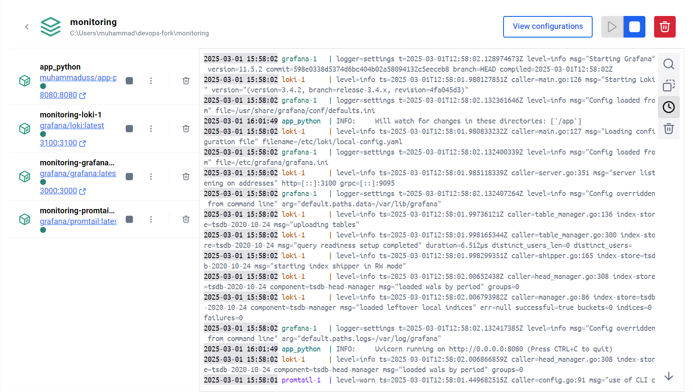
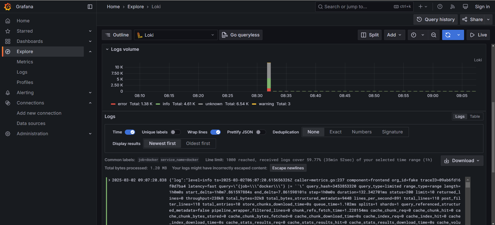
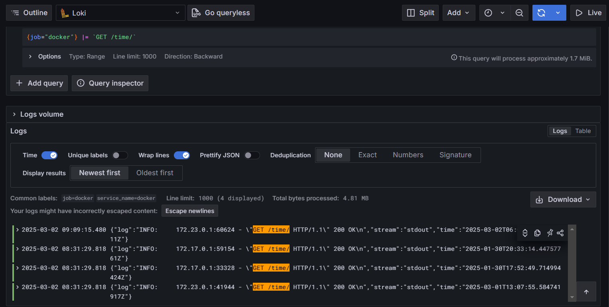

# Logging stack

For docker compose given `.yml` files were used with slight changes (e.g. mounting shortened `promtail.yml` and adding python application)

## Grafana

Provides convenient visualization of logs and metrics, allows to explore them. Represented with web UI, has interface for adding data sources for tools like Loki, Prometheus and so on.

## Loki

Server for storing logs and providing querying options. We add it to a Grafana by adding data source (in my case it was default preconfigured)

## Promtail

Agent that gathers logs and sends them to Loki. Configured in `promtail.yml` and mounted to promtail container. Sends to client by specified url (loki).

## Screenshots

### Docker compose

### Grafana View

### Querying logs with GET endpoint /time/ on python application

