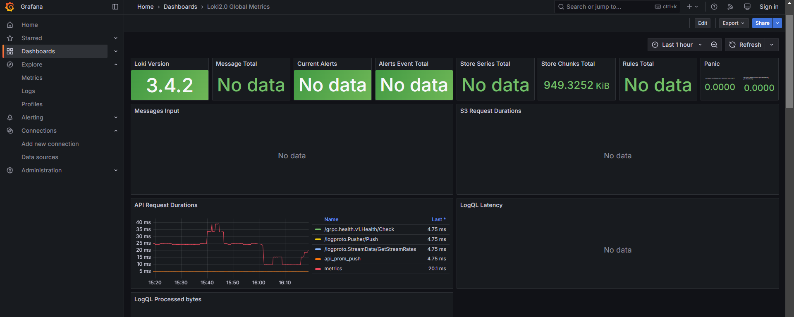

# Metrics 

## Targets

List of all prometheus targets


## Dashboards

Prometheus (using given example dashboard):


Loki (using given example dashboard):



## Service configuration updates

Added following lines for logging:

```
logging:
    driver: "json-file"
    options:
        max-size: "200k"
        max-file: "10"
```

Specified memory limit for each container by:

```
deploy:
    resources:
        limits:
        memory: 256M
```

## Python application metrics


## Healthchecks

Implemented for python application container, for grafana and for loki
