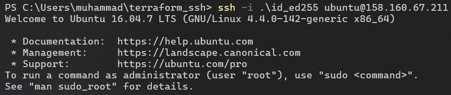

# Terraform

## Docker infrastructure

```sh
$ terraform state show docker_container.app_python
# docker_container.app_python:
resource "docker_container" "app_python" {
    attach                                      = false
    bridge                                      = null
    command                                     = [
        "uvicorn",
        "main:app",
        "--host",
        "0.0.0.0",
        "--port",
        "8080",
        "--reload",
    ]
    container_read_refresh_timeout_milliseconds = 15000
    cpu_set                                     = null
    cpu_shares                                  = 0
    domainname                                  = null
    entrypoint                                  = []
    env                                         = []
    hostname                                    = "65751f29ad1a"
    id                                          = "65751f29ad1a6d43fe25e61708bc996c219ed5246daac9363a7c881e4cb3ca06"
    image                                       = "sha256:9082d7688f862c585aa1975d5a16f76f67d68df52eac35b3885e34cc784d0232"
    init                                        = false
    ipc_mode                                    = "private"
    log_driver                                  = "json-file"
    logs                                        = false
    max_retry_count                             = 0
    memory                                      = 0
    memory_swap                                 = 0
    must_run                                    = true
    name                                        = "app_python"
    network_data                                = [
        {
            gateway                   = "172.17.0.1"
            global_ipv6_address       = null
            global_ipv6_prefix_length = 0
            ip_address                = "172.17.0.2"
            ip_prefix_length          = 16
            ipv6_gateway              = null
            mac_address               = "02:42:ac:11:00:02"
            network_name              = "bridge"
        },
    ]
    network_mode                                = "bridge"
    pid_mode                                    = null
    privileged                                  = false
    publish_all_ports                           = false
    read_only                                   = false
    remove_volumes                              = true
    restart                                     = "no"
    rm                                          = false
    runtime                                     = "runc"
    security_opts                               = []
    shm_size                                    = 64
    start                                       = true
    stdin_open                                  = false
    stop_signal                                 = null
    stop_timeout                                = 0
    tty                                         = false
    user                                        = "user"
    userns_mode                                 = null
    wait                                        = false
    wait_timeout                                = 60
    working_dir                                 = "/app"

    ports {
        external = 8080
        internal = 8080
        ip       = "0.0.0.0"
        protocol = "tcp"
    }
}
```

```bash
$ terraform state list
docker_container.app_python
```

```sh
$ terraform apply

Terraform used the selected providers to generate the following execution plan. Resource actions are indicated with the following symbols:
  + create

Terraform will perform the following actions:

  # docker_container.app_python will be created
  + resource "docker_container" "app_python" {
      + attach                                      = false
      + bridge                                      = (known after apply)
      + command                                     = (known after apply)
      + container_logs                              = (known after apply)
      + container_read_refresh_timeout_milliseconds = 15000
      + entrypoint                                  = (known after apply)
      + env                                         = (known after apply)
      + exit_code                                   = (known after apply)
      + hostname                                    = (known after apply)
      + id                                          = (known after apply)
      + image                                       = "muhammaduss/app-python"
      + init                                        = (known after apply)
      + ipc_mode                                    = (known after apply)
      + log_driver                                  = (known after apply)
      + logs                                        = false
      + must_run                                    = true
      + name                                        = "app_python"
      + network_data                                = (known after apply)
      + read_only                                   = false
      + remove_volumes                              = true
      + restart                                     = "no"
      + rm                                          = false
      + runtime                                     = (known after apply)
      + security_opts                               = (known after apply)
      + shm_size                                    = (known after apply)
      + start                                       = true
      + stdin_open                                  = false
      + stop_signal                                 = (known after apply)
      + stop_timeout                                = (known after apply)
      + tty                                         = false
      + wait                                        = false
      + wait_timeout                                = 60

      + healthcheck (known after apply)

      + labels (known after apply)

      + ports {
          + external = 8080
          + internal = 8080
          + ip       = "0.0.0.0"
          + protocol = "tcp"
        }
    }

Plan: 1 to add, 0 to change, 0 to destroy.

Do you want to perform these actions?
  Terraform will perform the actions described above.
  Only 'yes' will be accepted to approve.

  Enter a value: yes

docker_container.app_python: Creating...
docker_container.app_python: Creation complete after 5s [id=65751f29ad1a6d43fe25e61708bc996c219ed5246daac9363a7c881e4cb3ca06]
```

```bash
$ terraform output
container_id = "58a8f9da64a29af20c9f95beed62325688b384bd02eb25798b8b7f80fe92129c"
container_image = "muhammaduss/app-python"
container_name = "time_app_python"
```

## Yandex Cloud Infrastructure

Firstly, I created a billing account, configured SSH keys and created virtual machine (all by dedicated guides from Yandex Cloud).

In authentication part I installed CLI for YC, then proceeded further in initial guide:

```bash
$ yc iam key create   --service-account-id aje5r23lv7jf8bfbdtob   --folder-name default   --output key.json
id: ajebfsecvf5na7brk84u
service_account_id: aje5r23lv7jf8bfbdtob
created_at: "2025-02-11T08:27:05.365457508Z"
key_algorithm: RSA_2048
```

```bash
$ yc config profile create service-worker
Profile 'service-worker' created and activated
```

After setting profile configuration, and adding credentials to the environment variables, we can finally start Terraform part

I already configured `terraform.rc` while I was using docker infrastructure, so I created file `main.tf` and pasted following content:

```terraform
terraform {
  required_providers {
    yandex = {
      source = "yandex-cloud/yandex"
    }
  }
  required_version = ">= 0.13"
}

provider "yandex" {
  zone = "ru-central1-b"
}
```

Encountered mistake: I didnt change zone name, and firstly it was a template...

Then, used `terraform init`.

After, there was provided main.tf with ready plan for creating virtual machines, disks and nets, so I used it (with change that I removed second vm). In addition, created `variables.tf` with variables which can be used in `main.tf` for more convinience.

After that:

```bash
$ terraform validate
Success! The configuration is valid.
```

```sh
$ terraform apply

Terraform used the selected providers to generate the following execution plan. Resource actions are indicated with the following symbols:
  + create

Terraform will perform the following actions:

  # yandex_compute_disk.boot-disk-1 will be created
  + resource "yandex_compute_disk" "boot-disk-1" {
      + block_size  = 4096
      + created_at  = (known after apply)
      + folder_id   = (known after apply)
      + id          = (known after apply)
      + image_id    = "fd8hd9kt0cdnhkni2ehu"
      + name        = "boot-disk-1"
      + product_ids = (known after apply)
      + size        = 20
      + status      = (known after apply)
      + type        = "network-hdd"
      + zone        = "ru-central1-b"

      + disk_placement_policy (known after apply)

      + hardware_generation (known after apply)
    }

  # yandex_compute_instance.vm-1 will be created
  + resource "yandex_compute_instance" "vm-1" {
      + created_at                = (known after apply)
      + folder_id                 = (known after apply)
      + fqdn                      = (known after apply)
      + gpu_cluster_id            = (known after apply)
      + hardware_generation       = (known after apply)
      + hostname                  = (known after apply)
      + id                        = (known after apply)
      + maintenance_grace_period  = (known after apply)
      + maintenance_policy        = (known after apply)
      + metadata                  = {
          + "ssh-keys" = <<-EOT
                ubuntu:ssh-ed25519 AAAAC3NzaC1lZDI1NTE5AAAAIJMVzXVnizWH+F4fiYgNa+naGQpjooKwgvxT0UHfUiVb muhammad@DESKTOP-VVP81VA
            EOT
        }
      + name                      = "terraform1"
      + network_acceleration_type = "standard"
      + platform_id               = "standard-v1"
      + service_account_id        = (known after apply)
      + status                    = (known after apply)
      + zone                      = (known after apply)

      + boot_disk {
          + auto_delete = true
          + device_name = (known after apply)
          + disk_id     = (known after apply)
          + mode        = (known after apply)

          + initialize_params (known after apply)
        }

      + metadata_options (known after apply)

      + network_interface {
          + index              = (known after apply)
          + ip_address         = (known after apply)
          + ipv4               = true
          + ipv6               = (known after apply)
          + ipv6_address       = (known after apply)
          + mac_address        = (known after apply)
          + nat                = true
          + nat_ip_address     = (known after apply)
          + nat_ip_version     = (known after apply)
          + security_group_ids = (known after apply)
          + subnet_id          = (known after apply)
        }

      + placement_policy (known after apply)

      + resources {
          + core_fraction = 100
          + cores         = 2
          + memory        = 2
        }

      + scheduling_policy (known after apply)
    }

  # yandex_vpc_network.network-1 will be created
  + resource "yandex_vpc_network" "network-1" {
      + created_at                = (known after apply)
      + default_security_group_id = (known after apply)
      + folder_id                 = (known after apply)
      + id                        = (known after apply)
      + labels                    = (known after apply)
      + name                      = "network1"
      + subnet_ids                = (known after apply)
    }

  # yandex_vpc_subnet.subnet-1 will be created
  + resource "yandex_vpc_subnet" "subnet-1" {
      + created_at     = (known after apply)
      + folder_id      = (known after apply)
      + id             = (known after apply)
      + labels         = (known after apply)
      + name           = "subnet1"
      + network_id     = (known after apply)
      + v4_cidr_blocks = [
          + "192.168.10.0/24",
        ]
      + v6_cidr_blocks = (known after apply)
      + zone           = "ru-central1-b"
    }

Plan: 4 to add, 0 to change, 0 to destroy.

Changes to Outputs:
  + external_ip_address_vm_1 = (known after apply)
  + internal_ip_address_vm_1 = (known after apply)

Do you want to perform these actions?
  Terraform will perform the actions described above.
  Only 'yes' will be accepted to approve.

  Enter a value: yes

yandex_vpc_network.network-1: Creating...
yandex_compute_disk.boot-disk-1: Creating...
yandex_vpc_network.network-1: Creation complete after 4s [id=enp0ruqk86ljuvasn58t]
yandex_vpc_subnet.subnet-1: Creating...
yandex_vpc_subnet.subnet-1: Creation complete after 1s [id=e2l2eur33tngm0qncjh7]
yandex_compute_disk.boot-disk-1: Still creating... [10s elapsed]
yandex_compute_disk.boot-disk-1: Creation complete after 11s [id=epdgpnm1gjum2qep8nnf]
yandex_compute_instance.vm-1: Creating...
yandex_compute_instance.vm-1: Still creating... [10s elapsed]
yandex_compute_instance.vm-1: Still creating... [23s elapsed]
yandex_compute_instance.vm-1: Still creating... [33s elapsed]
yandex_compute_instance.vm-1: Still creating... [43s elapsed]
yandex_compute_instance.vm-1: Still creating... [57s elapsed]
yandex_compute_instance.vm-1: Creation complete after 1m2s [id=epd7dg1d5jgmflrhslsk]

Apply complete! Resources: 4 added, 0 changed, 0 destroyed.

Outputs:

external_ip_address_vm_1 = "158.160.67.211"
internal_ip_address_vm_1 = "192.168.10.3"
```

I forgot to format, so:

```bash
$ terraform fmt
variables.tf
```

Let's check that if we can access it (after submission, it might be not possible if infrastructure destroyed by `terraform destroy`):



## Github infrastructure

I followed given guidance and also imported and applied changes to existing private repo, by commands (I struggled a bit, but after searching and help - I found a bug):

```bash
terraform import "github_repository.repo" "todo-list"
terraform apply
```

Indeed, if I tried to make a commit in main - I got that I should create another branch by protection rules

## Best practices

- Utilizing `.tfvars` and hiding variables from being visible, especially sensitive ones like PAT
- Used `output.tf` in Docker infrastructure to specify info needed for output
- Used `terraform fmt` in each infrastructure to format files for better readability
- Used `terraform validate` in each infrastructure to validate that our declared files is correct
- Ignoring some files to being pushed to github which are not necessary: of course `.tfvars`, state files and plans
